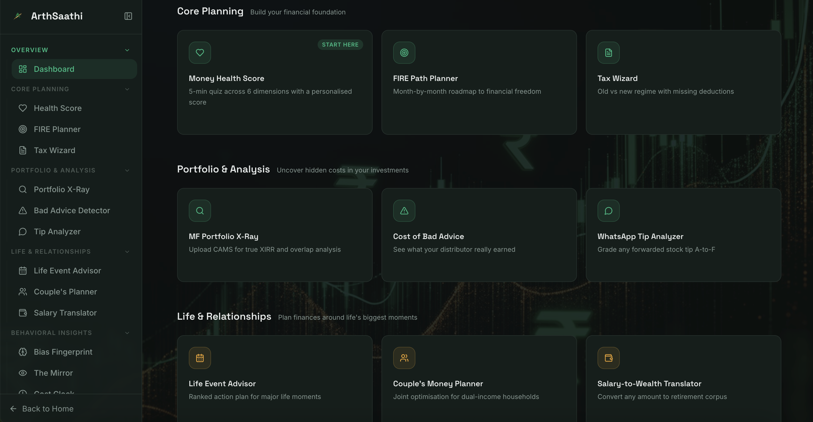
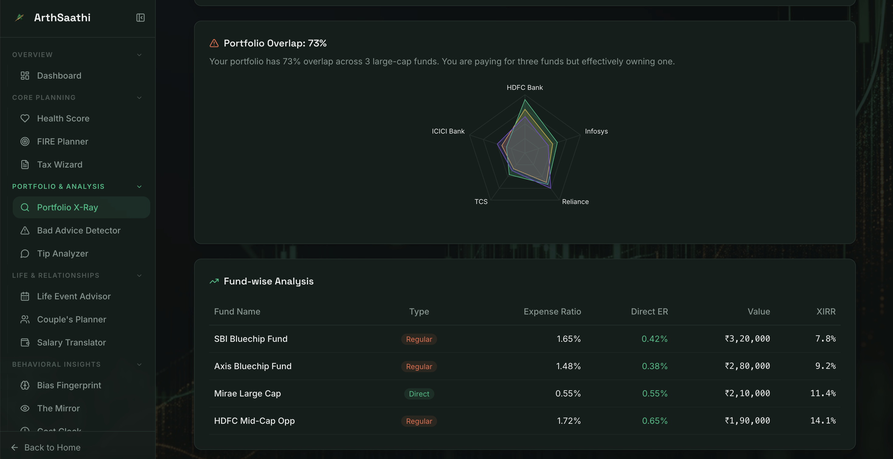
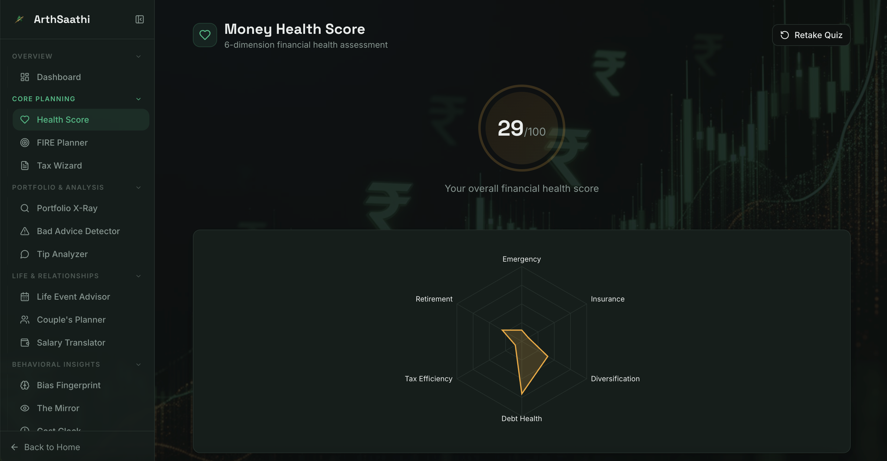
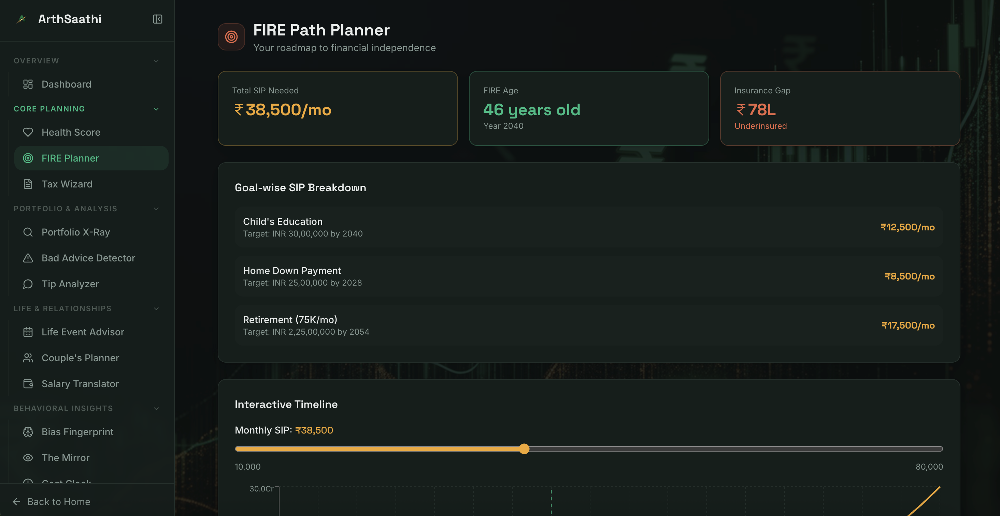
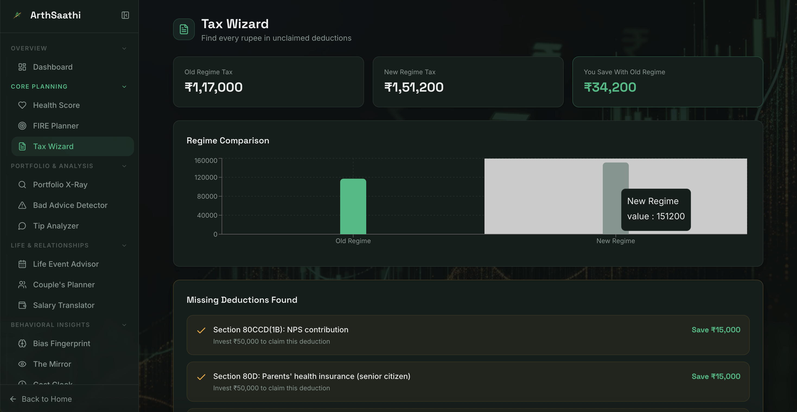
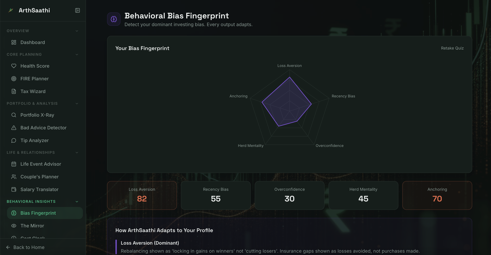
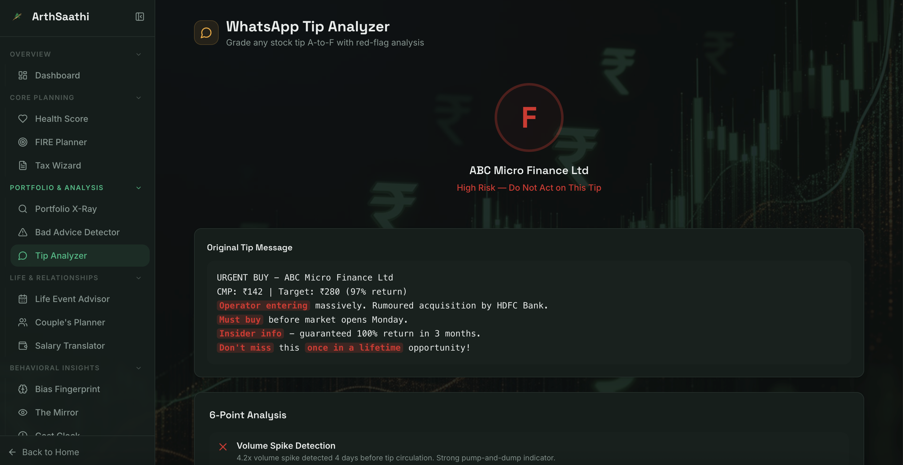
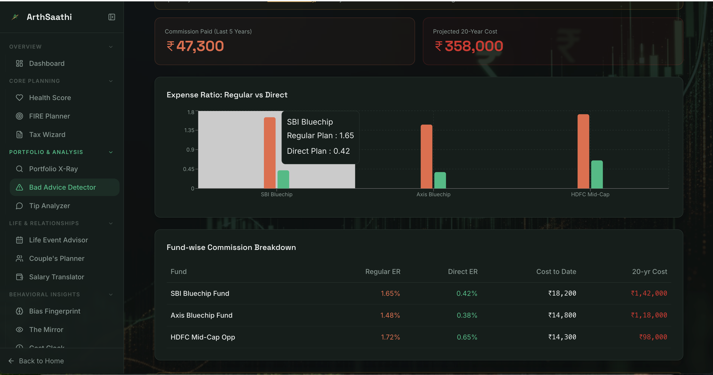

<div align="center">


# ArthSaathi

### India's AI-Powered Personal Finance Mentor

A CA, a financial advisor, and a tax consultant — free, in 60 seconds, for every Indian with a smartphone.

Built for the ET AI Hackathon 2026.

---


</div>

---

## What is ArthSaathi

ArthSaathi is a full-stack AI-powered personal finance platform built specifically for Indian retail investors. It diagnoses the true cost of bad financial decisions, detects behavioral biases that sabotage wealth creation, and delivers personalized, actionable guidance across 12 financial dimensions — all without requiring a paid advisor.

India has 14.2 crore demat accounts. 95% of retail investors have no financial plan. The advisor-to-investor ratio is 1:177. ArthSaathi exists to close that gap.

---

## Screenshots

<table>
  <tr>
    <td align="center">
      
      <br />
      <sub>Dashboard — Module Hub</sub>
    </td>
    <td align="center">
      
      <br />
      <sub>MF Portfolio X-Ray</sub>
    </td>
  </tr>
  <tr>
    <td align="center">
      
      <br />
      <sub>Money Health Score</sub>
    </td>
    <td align="center">
      
      <br />
      <sub>FIRE Path Planner</sub>
    </td>
  </tr>
  <tr>
    <td align="center">
      
      <br />
      <sub>Tax Wizard</sub>
    </td>
    <td align="center">
      
      <br />
      <sub>Behavioral Bias Fingerprint</sub>
    </td>
  </tr>
  <tr>
    <td align="center">
      
      <br />
      <sub>WhatsApp Tip Analyzer</sub>
    </td>
    <td align="center">
      
      <br />
      <sub>Cost of Bad Advice Detector</sub>
    </td>
  </tr>
</table>

---

## Modules

### Core Planning

| Module | What It Does | Value Delivered |
|---|---|---|
| Money Health Score | 5-minute quiz across 6 financial dimensions | Personalized score with fix links for every weak area |
| FIRE Path Planner | Month-by-month roadmap to financial independence | Exact SIP amounts, FIRE age, insurance gap analysis |
| Tax Wizard | Old vs new regime comparison with deduction scanner | Finds every rupee in unclaimed 80C, 80D, NPS deductions |

### Portfolio and Analysis

| Module | What It Does | Value Delivered |
|---|---|---|
| MF Portfolio X-Ray | Upload CAMS statement for full analysis | True XIRR, overlap score, hidden fee exposure |
| Cost of Bad Advice Detector | Exact rupee commission your distributor earned | 5-year paid + 20-year projected commission breakdown |
| WhatsApp Tip Analyzer | Paste any stock tip for A-to-F grading | Volume spike detection, language red flags, analyst coverage check |

### Life and Relationships

| Module | What It Does | Value Delivered |
|---|---|---|
| Life Event Advisor | Enter a life event, get a ranked action plan | Priority-ordered steps with exact rupee allocations |
| Couples Money Planner | Joint optimisation for dual-income households | HRA split, NPS matching, LTCG splitting, insurance review |
| Salary-to-Wealth Translator | Convert any rupee amount to retirement corpus | Reframes every financial decision as its 30-year value |

### Behavioral Insights

| Module | What It Does | Value Delivered |
|---|---|---|
| Behavioral Bias Fingerprint | 5-question quiz detects your dominant investing bias | All platform outputs adapt to your psychology |
| The Mirror | Stated preferences vs actual CAMS transaction behavior | Honest revised risk assessment based on real behavior |
| Procrastination Cost Clock | Live counter of wealth lost every second you delay | Makes the cost of inaction visceral and visible |

---

## Value Created Per User Per Year

| Driver | Benefit |
|---|---|
| Tax Optimisation | Save INR 24,000 to 36,000 per year in missed deductions |
| Direct Plan Switch | Save INR 7,000 per year on a 10L portfolio |
| Better Allocation | INR 45L more at retirement from 1% better CAGR |
| Insurance Gap Closure | Prevent catastrophic financial loss |
| Tip Protection | Avoid INR 18,000 to 45,000 loss per bad tip |
| HRA Couple Optimisation | Save INR 30,000 to 75,000 per year in reduced tax |

---

## Tech Stack

### Frontend

| Technology | Version | Purpose |
|---|---|---|
| React | 18.3 | UI framework |
| TypeScript | 5.8 | Type safety |
| Vite | 8.0 | Build tool |
| Tailwind CSS | 3.4 | Styling |
| shadcn/ui | latest | Component library |
| Framer Motion | 12 | Animations |
| Recharts | 2.15 | Data visualizations |
| React Router | 6.30 | Client-side routing |
| TanStack Query | 5.83 | Server state management |

### Backend

| Technology | Purpose |
|---|---|
| FastAPI | REST API framework |
| Anthropic Claude API | AI analysis and reasoning |
| pdfplumber | CAMS PDF parsing |
| scipy | XIRR calculation |
| httpx | AMFI NAV fetching |
| uvicorn | ASGI server |

---

## Project Structure

```
ArthSaathi/
├── frontend/
│   ├── src/
│   │   ├── assets/              # Logo, images
│   │   ├── components/
│   │   │   ├── landing/         # HeroSection, FeaturesGrid, ValueSection, CTASection
│   │   │   ├── layout/          # DashboardLayout, Navbar, NavLink
│   │   │   └── ui/              # shadcn/ui primitives (40+ components)
│   │   ├── context/
│   │   │   └── CAMSContext.tsx  # Shared CAMS state across all pages
│   │   ├── hooks/
│   │   │   ├── useCAMSData.ts   # CAMS data fetching and state
│   │   │   ├── useBiasProfile.ts# Bias detection and framing adapters
│   │   │   ├── use-mobile.tsx   # Responsive breakpoint hook
│   │   │   └── use-toast.ts     # Toast notification hook
│   │   ├── lib/
│   │   │   ├── api.ts           # apiPost and apiUpload helpers
│   │   │   └── utils.ts         # cn() utility
│   │   ├── pages/               # 14 route pages
│   │   └── index.css            # Global styles, CSS variables, dark theme
│   ├── .env                     # VITE_API_URL
│   └── package.json
│
├── backend/
│   ├── main.py                  # FastAPI app + CORS
│   ├── routes/
│   │   ├── xray.py              # POST /api/xray
│   │   ├── tax.py               # POST /api/tax
│   │   ├── fire.py              # POST /api/fire
│   │   ├── tip.py               # POST /api/tip
│   │   └── score.py             # POST /api/score
│   ├── agents/
│   │   ├── orchestrator.py      # Master multi-step agent
│   │   ├── portfolio_agent.py   # CAMS analysis via Claude
│   │   ├── tax_agent.py         # Tax optimisation via Claude
│   │   ├── tip_agent.py         # Tip grading via Claude
│   │   ├── planning_agent.py    # FIRE planning via Claude
│   │   ├── bias_agent.py        # Bias detection via Claude
│   │   └── compliance_agent.py  # SEBI compliance wrapper
│   ├── utils/
│   │   ├── cams_parser.py       # PDF extraction
│   │   ├── xirr_engine.py       # XIRR calculation
│   │   ├── overlap_calc.py      # Portfolio overlap
│   │   ├── fire_calc.py         # FIRE date projection
│   │   ├── tax_calc.py          # Old vs new regime
│   │   └── amfi_client.py       # Live NAV fetching
│   └── requirements.txt
│
└── docs/
    └── screenshots/             # All README screenshots live here
```

---

## Getting Started

### Prerequisites

- Node.js 18 or higher
- Python 3.11 or higher
- An Anthropic API key

### Frontend Setup

```bash
cd frontend
npm install
cp .env.example .env
# Edit .env and set VITE_API_URL=http://localhost:8000
npm run dev
```

Frontend runs at `http://localhost:8080`

### Backend Setup

```bash
cd backend
pip install -r requirements.txt
export ANTHROPIC_API_KEY=your_key_here
uvicorn main:app --reload --port 8000
```

Backend runs at `http://localhost:8000`

### Environment Variables

**Frontend** — `frontend/.env`
```
VITE_API_URL=http://localhost:8000
```

**Backend**
```
ANTHROPIC_API_KEY=your_anthropic_api_key
```

---

## API Reference

| Method | Endpoint | Input | Used By |
|---|---|---|---|
| POST | `/api/xray` | CAMS PDF file (multipart) | Portfolio X-Ray |
| POST | `/api/tax` | salary, HRA, rent, city, flags | Tax Wizard |
| POST | `/api/fire` | age, income, expenses, goals | FIRE Planner |
| POST | `/api/tip` | tip text string | Tip Analyzer |
| POST | `/api/bias` | quiz answer indices | Bias Fingerprint |

All endpoints return JSON. All endpoints fall back to demo data in the frontend if the backend is unavailable.

---

## Design System

The UI uses a custom dark theme built on CSS variables with three primary accent colors:

| Token | Color | Used For |
|---|---|---|
| `--emerald` | hsl(160 85% 40%) | Primary actions, positive states |
| `--gold` | hsl(38 90% 55%) | Planning, neutral highlights |
| `--coral` | hsl(12 80% 60%) | Risk, warnings, urgent alerts |
| `--violet` | hsl(260 55% 55%) | Behavioral insights |

Typography uses Space Grotesk for headings and Inter for body text.

---

## Behavioral Bias System

ArthSaathi detects five behavioral biases from quiz responses and adapts every output accordingly:

| Bias | Platform Adaptation |
|---|---|
| Loss Aversion | Rebalancing framed as locking in gains, not cutting losers |
| Recency Bias | 10-year returns shown first, 1-year returns shown last |
| Overconfidence | Index fund data presented before active fund comparisons |
| Herd Mentality | Peer comparison data shown with contrarian context |
| Anchoring | Opportunity cost of waiting calculated explicitly |

---

## Offline and Demo Mode

Every page in ArthSaathi works without a backend connection. When an API call fails, the frontend silently falls back to realistic demo data so the full product experience is always available. This is intentional — the demo data is seeded with real fund names, realistic XIRRs, and accurate Indian tax calculations.

---

## License

MIT License. See `LICENSE` for details.

---

<div align="center">

Built with care for Indian retail investors.

ArthSaathi — AI Money Mentor

</div>